# StatComply Module-Wise Training Flow

This document is the trainer version of the user manual. It is designed for role-based induction, refresher sessions, and process training. Each module includes the full working cycle, exception handling, handoff points, and screenshot references.

## 1. Training Use

Use this document in the following order:

1. Explain the role and what that user is responsible for.
2. Show the dashboard and menu structure.
3. Walk through the daily working cycle in sequence.
4. Explain what happens when an item is delayed, rejected, or escalated.
5. End with the handoff to the next team or next system user.

## 2. Common Login Flow

Use this flow before starting any role session:

1. Open the portal URL.
2. Enter the role-specific email address.
3. Enter the password.
4. Click **Sign In**.
5. Confirm that the user lands on the correct dashboard.
6. Explain the left menu and the top profile area before starting the actual process.

Reference screenshots:

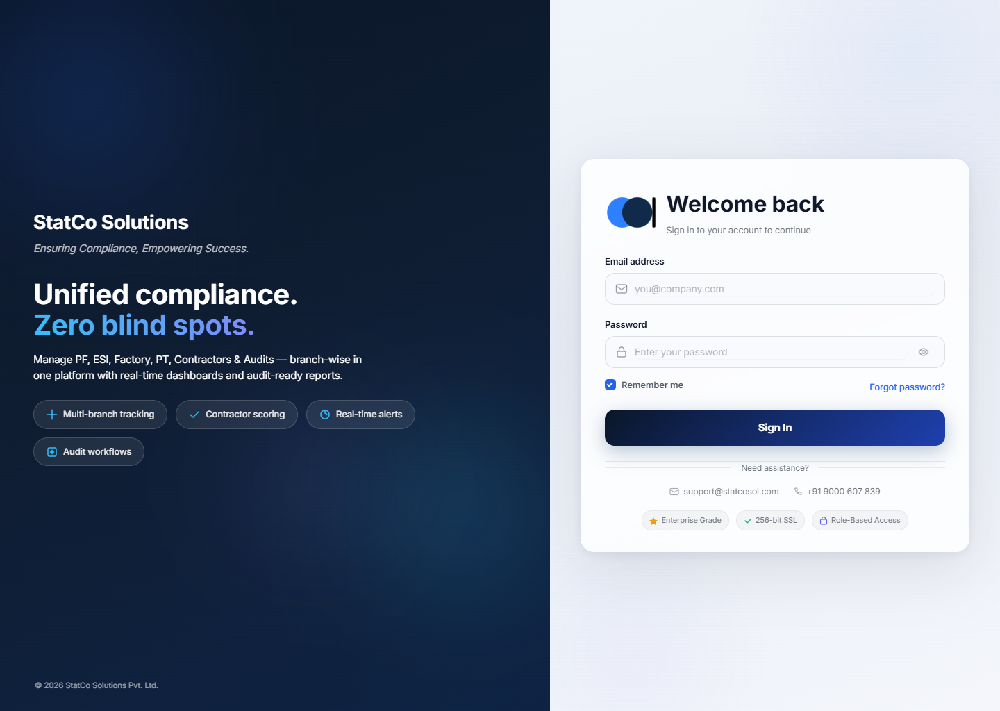

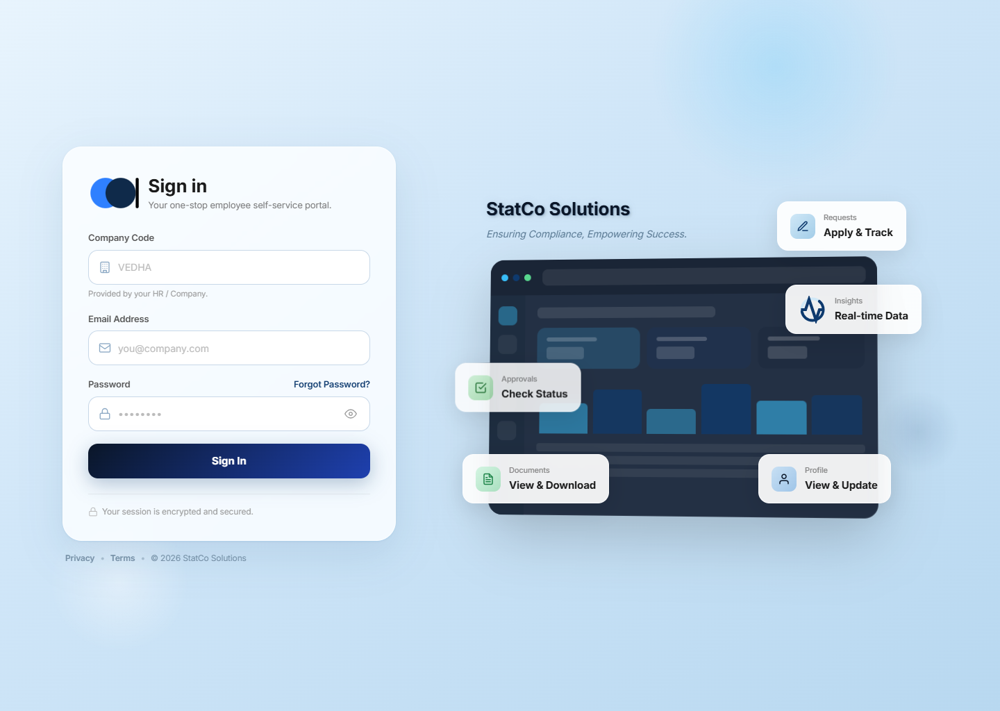

## 3. End-to-End Platform Flow

Use this summary before role-wise training so users understand where their work fits:

1. Admin creates users, clients, branches, and assignments.
2. Client and Branch teams maintain employee, branch, and compliance data.
3. Branch users upload monthly and periodic compliance evidence.
4. CRM reviews branch submissions, manages returns, renewals, and audits.
5. Contractor users complete assigned compliance tasks and upload evidence.
6. Auditor executes assigned audits and finalizes reports.
7. CCO monitors CRM performance, approvals, controls, and escalations.
8. CEO reviews executive alerts, escalations, reports, and registers.
9. Payroll processes client payroll, registers, and statutory outputs.
10. Employees use ESS for payslips, documents, leave, and helpdesk.
11. PF Team resolves PF, ESI, and payslip-related tickets.

## 4. Admin Training Flow

**Training objective:** teach the Admin how to onboard a client, create users, assign ownership, configure masters, and monitor system health.

### 4.1 Daily Admin Working Cycle

1. Log in and open the dashboard.
2. Review system KPI cards: Clients, Branches, SLA Health, Overdue, Due Soon, and Unread.
3. Review risk alerts and unassigned ownership gaps.
4. Check escalations, failed jobs, failed notifications, and inactive users.
5. Open notifications or alerts that need immediate action.

### 4.2 New Client Onboarding Flow

1. Open **Clients**.
2. Fill company details: company name, master user name, email, mobile, and password.
3. Save the client and confirm the system creates the company plus master login.
4. Open the new client record and switch to the branch setup area.
5. Create the required branches with type, location, address, and branch user details.
6. Open the compliance applicability area and map applicable laws/compliances branch-wise.
7. Validate that the client now has branches and applicable compliance items.

### 4.3 User Creation and Access Flow

1. Open **Users**.
2. Expand **Create User**.
3. Select the role such as Admin, CEO, CCO, CRM, Auditor, Payroll, PF Team, Client, or Contractor.
4. Fill name, email, mobile, and password.
5. If the role requires client or team mapping, complete those fields.
6. Save the user and verify the user appears in the list.
7. Demonstrate search, filter, edit, activate, deactivate, and delete actions.

### 4.4 Ownership and Governance Flow

1. Open **Assignments** and map a CRM and Auditor to the client.
2. Open **Payroll Assignments** and map the Payroll user to the client.
3. Open **Governance Center** or **Unassigned Clients** and confirm no ownership gap remains.
4. Explain that incomplete assignments will block smooth downstream processing.

### 4.5 Admin Exception and Escalation Handling

1. If a client has no CRM, assign one immediately.
2. If a client has no Auditor or Payroll owner, complete those assignments.
3. If alerts show failed jobs or failed notifications, capture them for system follow-up.
4. If a user is inactive or incorrectly mapped, update the user record.

### 4.6 Admin Handoff

1. Hand off the client to the Client master user and Branch users for business data setup.
2. Hand off the client to CRM, Auditor, and Payroll based on assignments.
3. Confirm credentials are shared securely.

Reference screenshots:

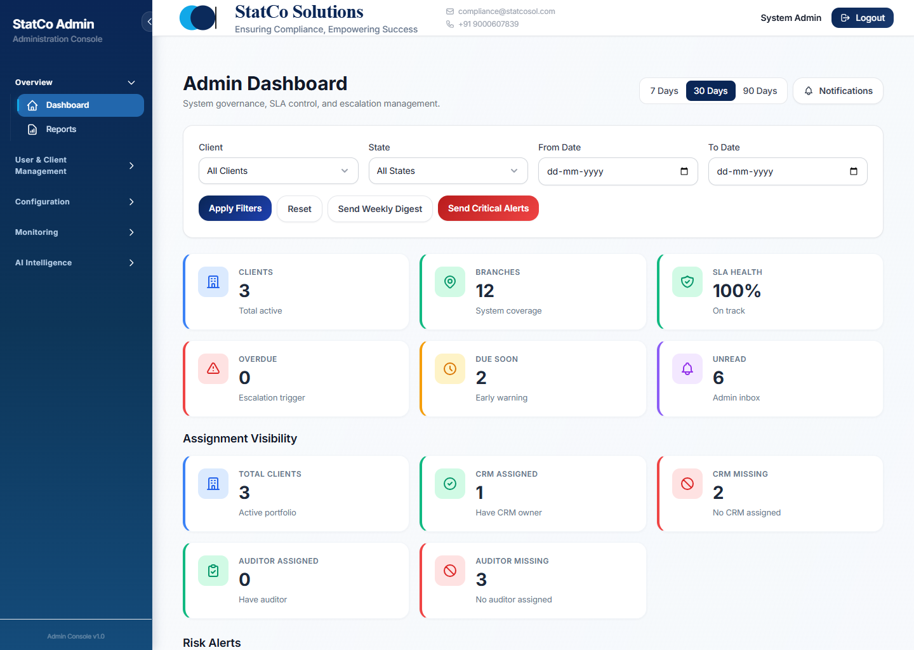

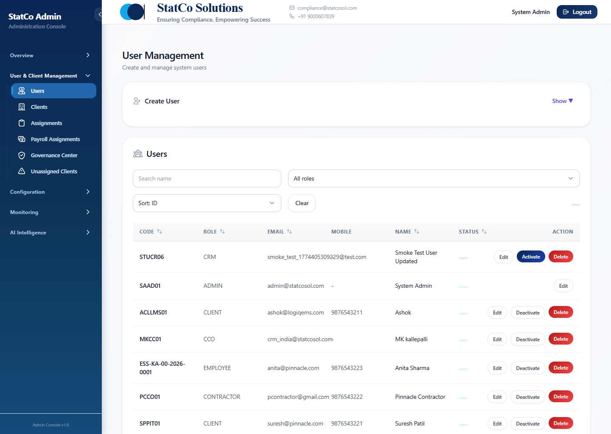

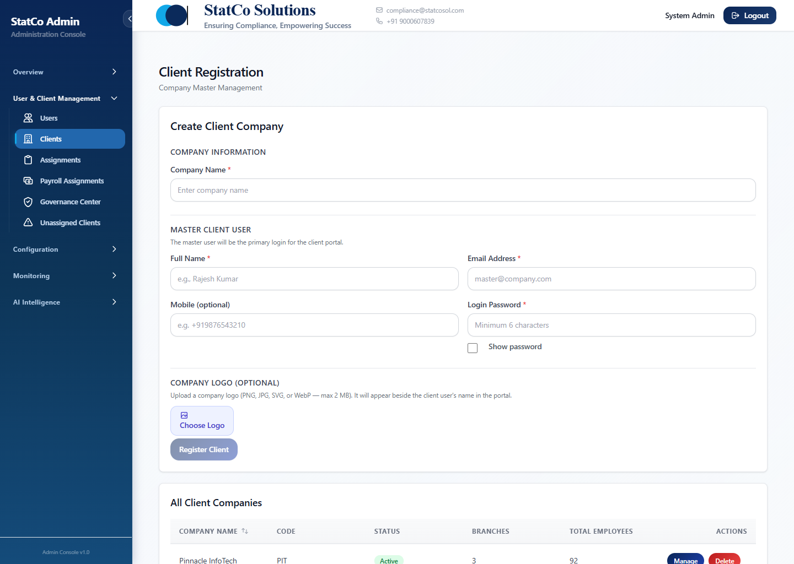

## 5. CEO Training Flow

**Training objective:** teach the CEO how to review business risk, approvals, escalations, reports, and register outputs.

### 5.1 Daily Executive Review

1. Log in and open the dashboard.
2. Review Total Clients, Pending Approvals, Active Audits, Overdue Compliances, Team Size, and Compliance Score.
3. Read the executive guardrails section first because that shows the top decision items.
4. Review overall compliance rate and audit completion trends.
5. Review the monthly trend and high-risk branch/client views.

### 5.2 Approval Flow

1. Open **Approvals** from the card or left menu.
2. Review the request details and business impact.
3. Approve or reject the item with comments.
4. Explain that rejected items move back to the previous owner for correction.

### 5.3 Escalation Review Flow

1. Open **Escalations**.
2. Review client, branch, issue type, age, and priority.
3. Add comments, direct follow-up, or close the escalation if resolved.
4. Explain when an escalation should stay with CCO and when it should be raised to executive level.

### 5.4 Report and Register Review Flow

1. Open **Reports**.
2. Select the required period.
3. Preview the executive report pack.
4. Export PDF or CSV as required.
5. Open **Registers** and explain how payroll or statutory registers are reviewed centrally.

### 5.5 CEO Handoff

1. CEO decisions move back to CCO, CRM, Payroll, or Admin depending on the item.
2. Unresolved or repeated business risks should be tracked in executive review meetings.

Reference screenshots:

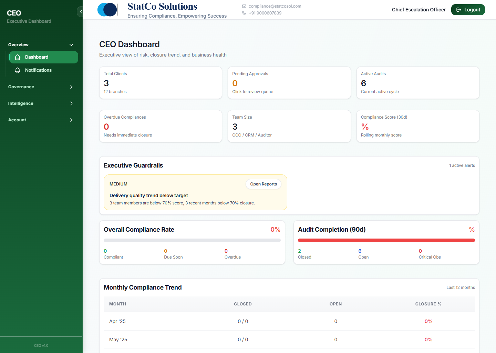

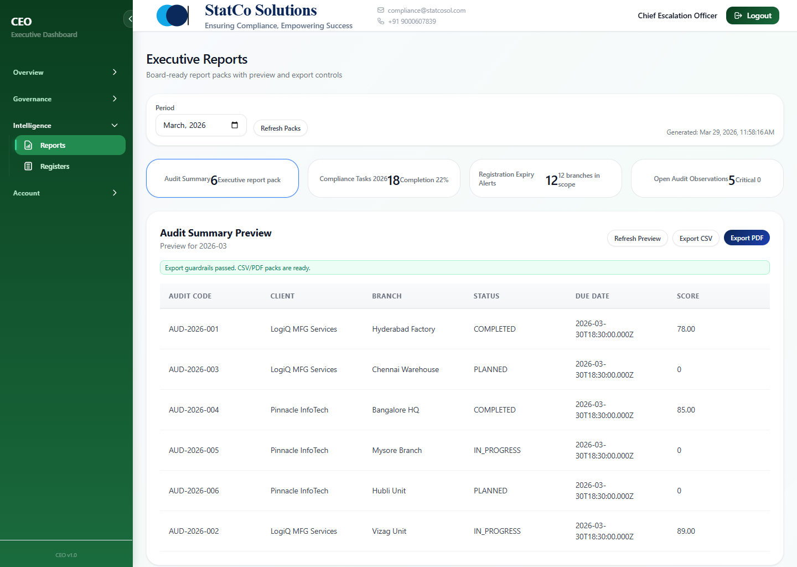

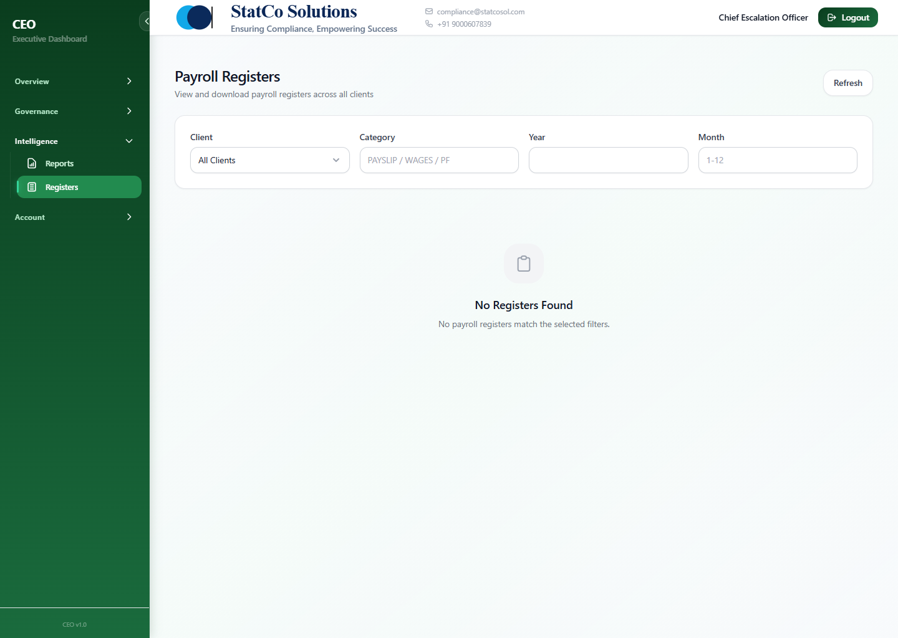

## 6. CCO Training Flow

**Training objective:** teach the CCO how to supervise the CRM team, process approvals, manage controls, and close escalations.

### 6.1 Daily Oversight Flow

1. Log in and open the dashboard.
2. Review Pending Approvals, Total CRMs, Overdue Tasks, and Escalations.
3. Review the CRM team performance table.
4. Identify clients, branches, or CRMs with repeated overdue items.
5. Use this screen to decide where immediate follow-up is required.

### 6.2 Team Governance Flow

1. Open **CRMs Under Me**.
2. Review which CRMs report to the CCO.
3. Open **CRM Performance** and explain overdue count, client ownership, and execution quality.
4. Use this page to identify low-performing portfolios.

### 6.3 Approval and Controls Flow

1. Open **Approvals** and review pending items.
2. Approve or reject with comments.
3. Open **Controls**.
4. Review or configure SLA rules, reminder rules, and escalation thresholds.
5. Explain that these controls define how overdue and escalated items are treated.

### 6.4 Escalation and Risk Flow

1. Open **Escalations**.
2. Filter by status or type.
3. Review the issue, assign follow-up, notify the owner, or close the item.
4. Open **Risk Heatmap** and explain how high-risk branches or clients are identified.
5. Open **Registers** to review central output availability when needed.

### 6.5 CCO Handoff

1. Send corrective actions back to CRM owners.
2. Send major unresolved issues upward to CEO.
3. Coordinate with Admin when a control gap is due to setup or ownership issues.

Reference screenshots:

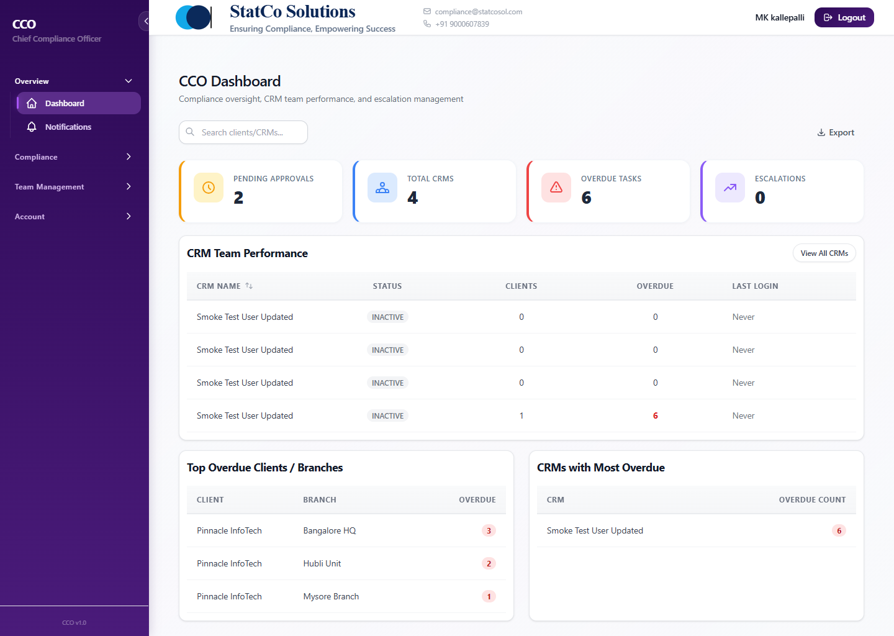

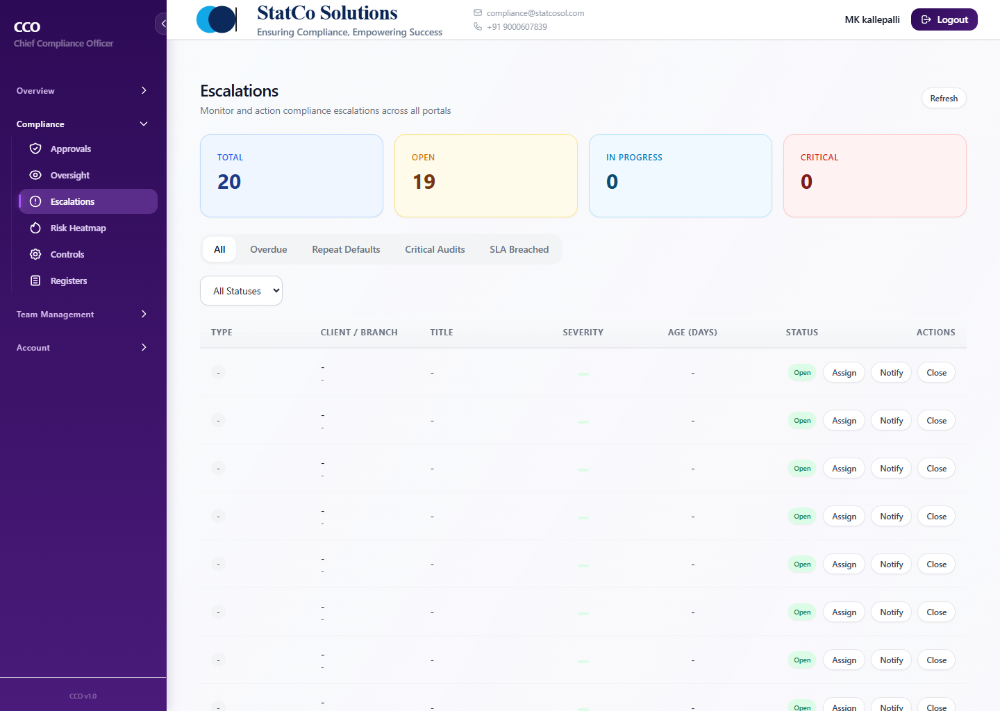

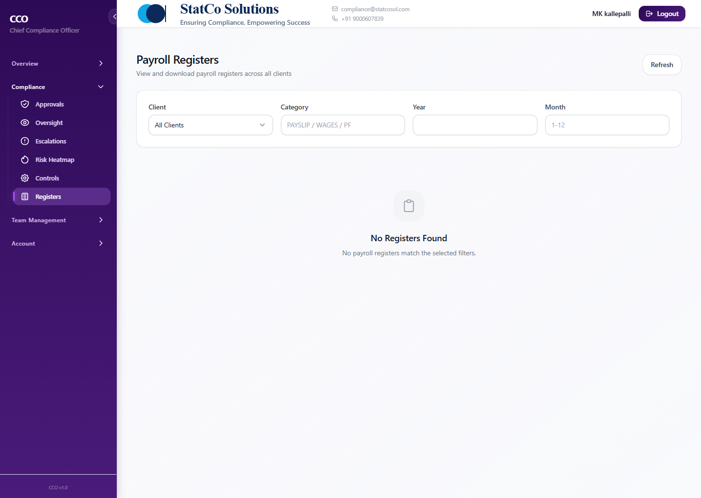

## 7. CRM Training Flow

**Training objective:** teach the CRM how to manage the assigned client portfolio from review queue to filings, audits, renewals, and escalations.

### 7.1 Daily CRM Start-of-Day Flow

1. Log in and open the dashboard.
2. Review Assigned Clients, Compliance Percentage, Pending Reviews, Overdue, Expiring 30 Days, and Reupload Required.
3. Use the quick shortcuts to jump directly into the review queue or returns workspace.
4. Review due compliances by tab: Overdue, Due Soon, and This Month.
5. Identify the highest-risk branch or client first.

### 7.2 Client Portfolio Flow

1. Open **All Clients**.
2. Select a client from the assigned list.
3. Open the client workspace.
4. Review branches, contractors, documents, payroll status, and branch compliance from the client workspace.
5. Explain that CRM uses this workspace to understand the client before taking review or escalation decisions.

### 7.3 Document Review and Reupload Flow

1. Open **Document Review Center**.
2. Filter by client, branch, or review status.
3. Open a submitted document.
4. Approve the document if it is valid.
5. If the document is incomplete or incorrect, return it for reupload with remarks.
6. Explain that the Branch user will correct and resubmit the document.

### 7.4 Returns and Filings Flow

1. Open **Returns / Filings**.
2. Filter the queue by client, branch, status, month, or act.
3. Review the filing detail panel.
4. Update the filing through its normal stages: Prepared, Reviewed, Filed, Acknowledged.
5. Upload challan, filing proof, or acknowledgment where required.
6. Explain how rejected items or pending evidence will hold closure.

### 7.5 Audit Management Flow

1. Open **Audits**.
2. Create a new audit for a client and branch.
3. Select audit type, period, due date, and owner details.
4. Assign an Auditor.
5. Monitor audit status from Planned to In Progress to Completed.
6. Track report status and readiness after fieldwork is complete.

### 7.6 CRM Escalation and Handoff Flow

1. Open **SLA Tracker** and **Escalations** for overdue or high-risk items.
2. Work the item first at CRM level.
3. If the item remains overdue or blocked, it moves to CCO review.
4. If the issue is severe or unresolved, it moves to CEO.
5. Hand off approved review outcomes back to Branch, Contractor, Payroll, or Client depending on the workflow.

Reference screenshots:

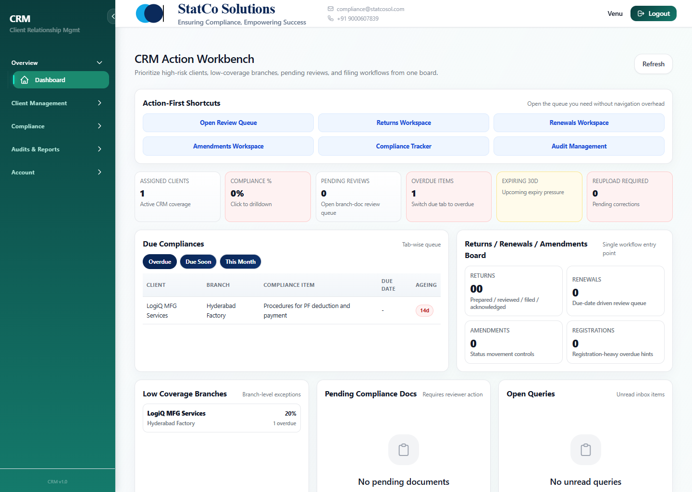

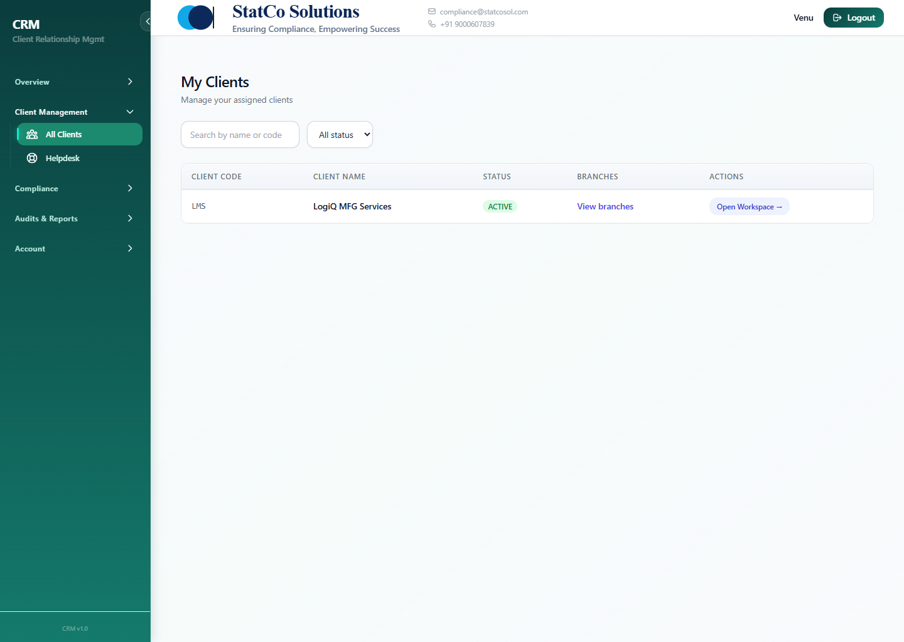

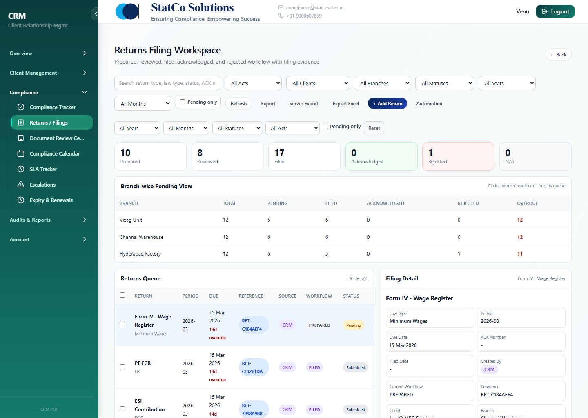

## 8. Client Training Flow

**Training objective:** teach the Client master user how to monitor company-wide compliance, branches, employees, contractors, and approvals.

### 8.1 Daily Client Review Flow

1. Log in and open the dashboard.
2. Use the month, year, branch, and contractor filters.
3. Review employee count, contractor count, payroll pending, branches live, compliance score, critical items, and registrations.
4. Review charts and the AI summary section.
5. Identify which branch or business area needs follow-up.

### 8.2 Branch Monitoring Flow

1. Open **Branches**.
2. Review all branch records and branch types.
3. Open a branch workspace when drill-down is needed.
4. Review branch compliance, registrations, documents, and observations.

### 8.3 Employee and Payroll Master Flow

1. Open **Employees**.
2. Review the employee master list.
3. Demonstrate add, import, view, edit, and deactivate actions where applicable.
4. Explain the importance of Aadhaar, PAN, UAN, ESI, mobile, bank, and designation data.
5. Open payroll-related pages as needed to review payroll readiness and pending items.

### 8.4 Approval and Support Flow

1. Open **Approvals Center**.
2. Review pending approval items.
3. Approve or reject nominations, leave, or other routed items with comments.
4. Open **My Queries** for support follow-up.
5. Raise a new query when business users need CRM, Payroll, or system support.

### 8.5 Client Handoff

1. Share employee, branch, payroll, and compliance updates with Branch and Payroll teams.
2. Escalate unresolved compliance execution issues to CRM.
3. Use dashboard and support screens to track whether follow-up is complete.

Reference screenshots:

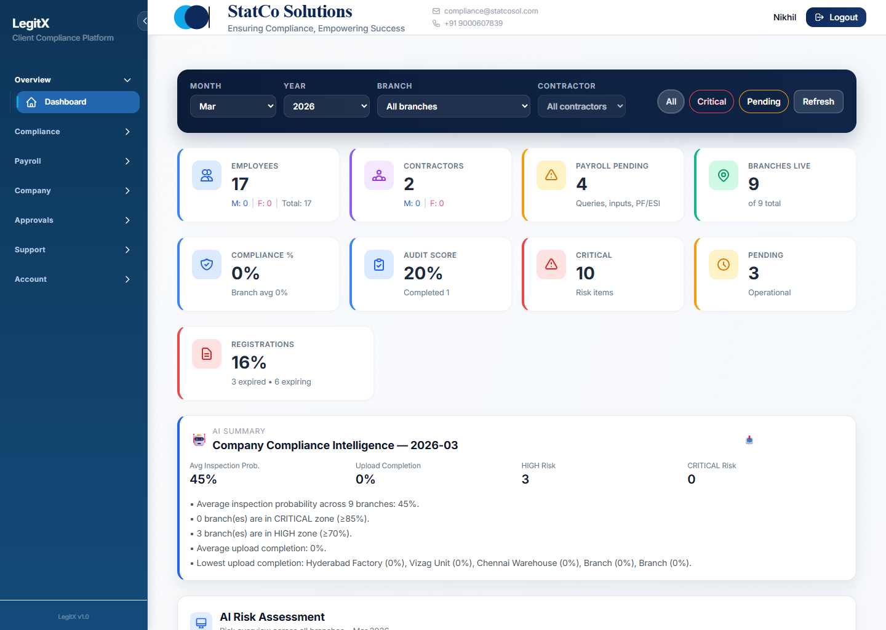

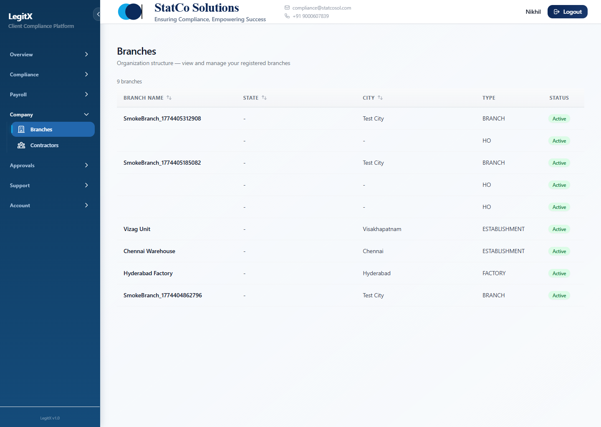

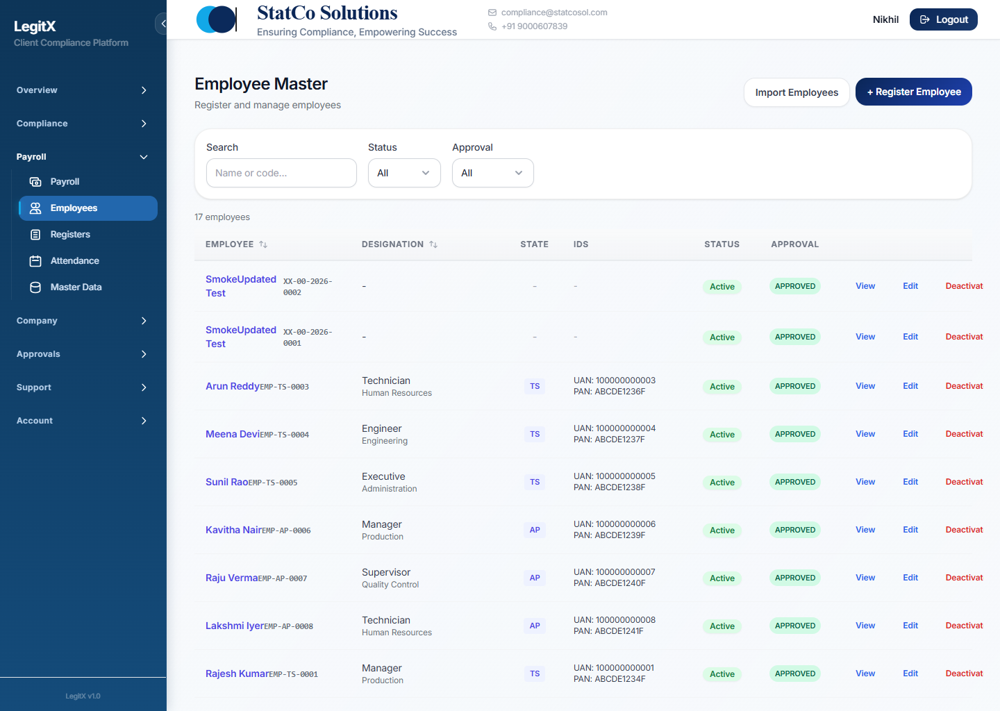

## 9. Branch Training Flow

**Training objective:** teach the Branch user how to complete monthly and periodic compliance work, respond to reupload remarks, and maintain branch-level records.

### 9.1 Daily Branch Review Flow

1. Log in and open the dashboard.
2. Review employee headcount, contractor headcount, PF pending, and ESIC pending.
3. Review compliance score, document upload completion, and open audit observations.
4. Review pending actions and expiry tracker.
5. Identify what must be uploaded or corrected today.

### 9.2 Monthly Compliance Flow

1. Open **Monthly Compliance**.
2. Set month, year, law area, category, or status filters.
3. Review upload completion, total applicable items, pending items, returned items, query items, and overdue items.
4. Select an item from the applicable upload list.
5. Review due date, current version, uploaded status, and review state.
6. Upload the required file and notes.
7. Refresh and confirm the status is updated.

### 9.3 Periodic Upload Flow

1. Open **Periodic Uploads**.
2. Choose Quarterly, Half-Yearly, or Yearly tab.
3. Select the statutory period and year.
4. Review total applicable items, uploaded, pending, in review, returned, overdue, and completeness.
5. Open a filing item, upload the required document, and submit.
6. Explain that CRM will review the submission after upload.

### 9.4 Reupload Handling Flow

1. Return to **Monthly Compliance** or **Periodic Uploads** when CRM returns an item.
2. Open the returned item and read the remarks.
3. Upload the corrected evidence.
4. Resubmit for review.
5. Confirm that the item leaves the returned queue.

### 9.5 Branch Data and Support Flow

1. Open **Employees** and **Contractors** to maintain branch visibility.
2. Open **Documents**, **Reports**, and **Audit Observations** when supporting review or audit work.
3. Use **Helpdesk** if the branch cannot complete an item due to a blocker.

### 9.6 Branch Handoff

1. Submissions move to CRM for review.
2. Rejected items come back to the Branch user for correction.
3. Overdue items may escalate upward through SLA and escalation workflows.

Reference screenshots:

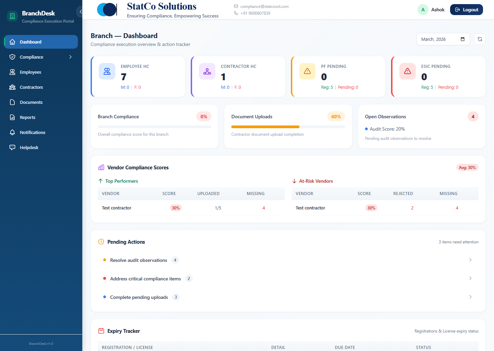

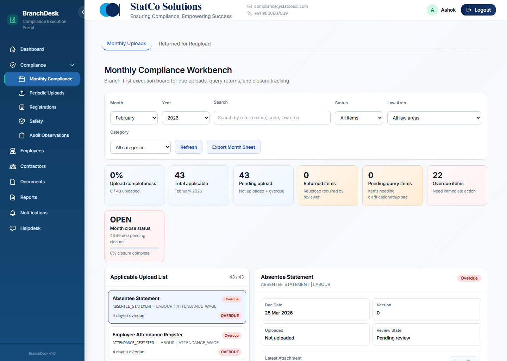

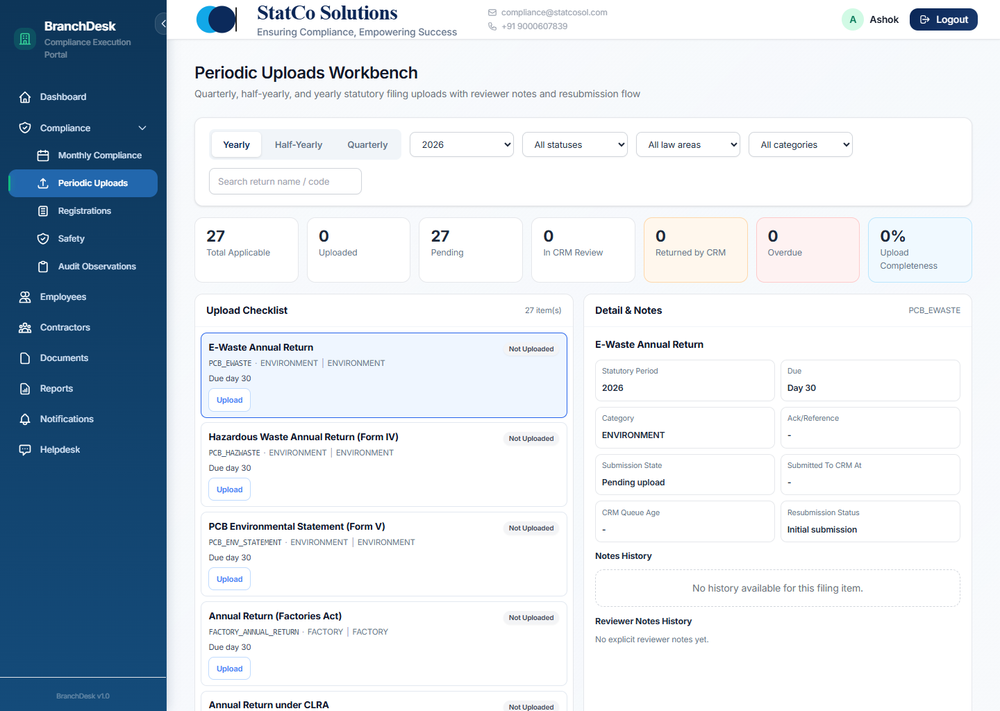

## 10. Auditor Training Flow

**Training objective:** teach the Auditor how to execute assigned audits, log observations, request reuploads, and finalize reports.

### 10.1 Daily Audit Review Flow

1. Log in and open the dashboard.
2. Use client, audit type, and date filters.
3. Review Assigned, Pending, In Progress, Submitted, Reverification, and Closed counts.
4. Open the active or upcoming audit list.
5. Choose the next due audit from the queue.

### 10.2 Assigned Audits Flow

1. Open **Audits**.
2. Filter by client, audit type, status, or search text.
3. Review the assigned audits table.
4. Open the workspace from the row action.

### 10.3 Audit Workspace Flow

1. Review audit scope, client, branch, period, and due date.
2. Review the evidence tray and available compliance data.
3. If a document is missing or insufficient, request reupload with remarks.
4. Create observations with category, observation text, impact, recommendation, and risk level.
5. Calculate severity where required.
6. Advance the audit through fieldwork and report progress.
7. Mark the audit complete when checklist items are finished.

### 10.4 Report Builder Flow

1. Open **Reports**.
2. Select the audit from the list.
3. Open the builder.
4. Prepare the final report content.
5. Export or finalize the report.

### 10.5 Auditor Handoff

1. Reupload requests go back to the source team for correction.
2. Completed audit outputs are consumed by CRM, CCO, and CEO for follow-up and reporting.
3. Open observations remain a live compliance action until verified.

Reference screenshots:

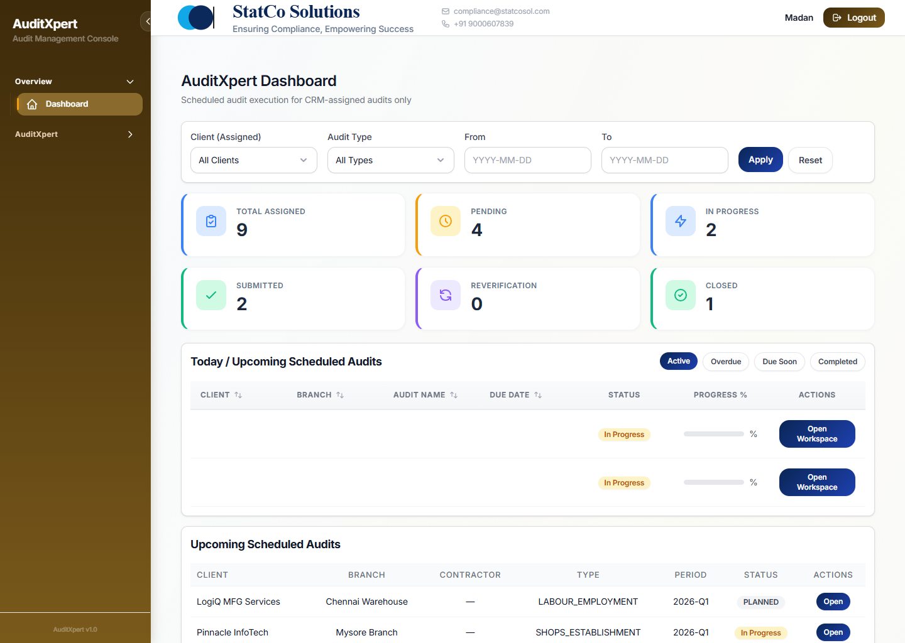

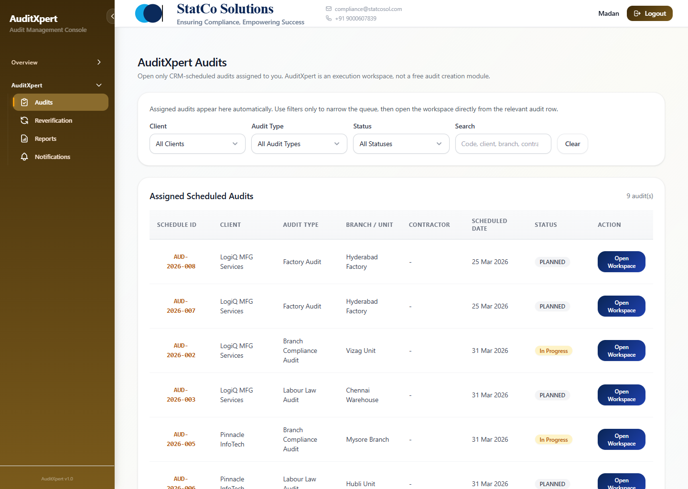

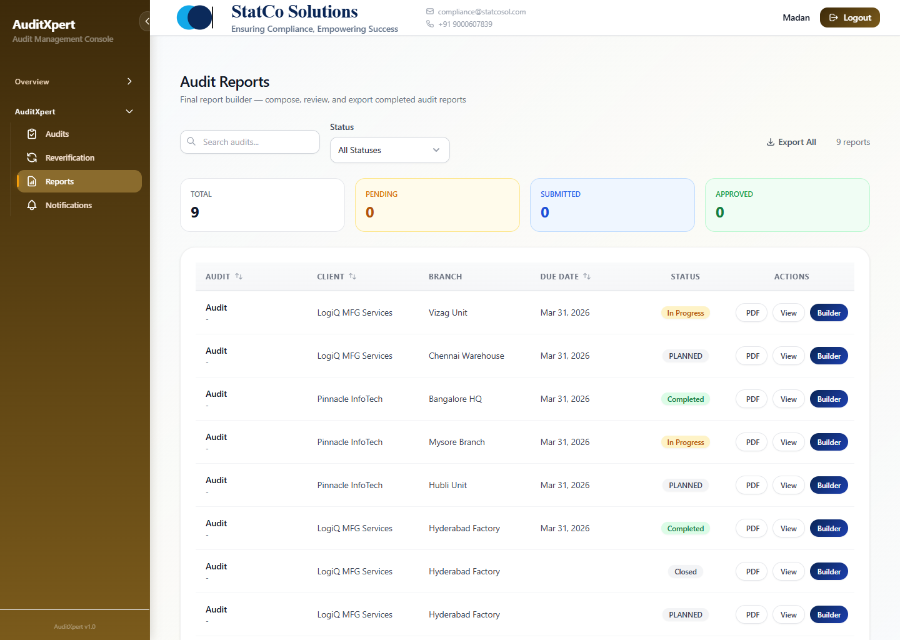

## 11. Contractor Training Flow

**Training objective:** teach the Contractor how to work on assigned tasks, upload evidence, respond to rejection, and raise support requests.

### 11.1 Daily Contractor Review Flow

1. Log in and open the dashboard.
2. Review Required Docs, Due Today, Overdue, In Progress, and Awaiting Approval.
3. Review branch-wise status and pending uploads.
4. Identify which task or reupload must be completed first.

### 11.2 Task Execution Flow

1. Open **Tasks**.
2. Review the summary cards and filters.
3. Select a task from the left panel.
4. Read the task requirement, due date, and branch details.
5. Click **Start Task** if the task is still pending.
6. Upload evidence and add notes.
7. Use the reply section if clarification is needed.
8. Click **Submit Task** when evidence is complete.

### 11.3 Rejection and Reupload Flow

1. If the task is rejected, open the same task again.
2. Read the rejection reason carefully.
3. Upload corrected evidence.
4. Resubmit the task for review.

### 11.4 Support Flow

1. Open **Support**.
2. Select the query type.
3. Enter subject and message.
4. Submit the query.
5. Track the thread under **My Threads**.

### 11.5 Contractor Handoff

1. Submitted work moves to CRM or the relevant reviewer for approval.
2. Rejected work returns to the Contractor.
3. Repeated blockers should be raised through Support instead of only task comments.

Reference screenshots:

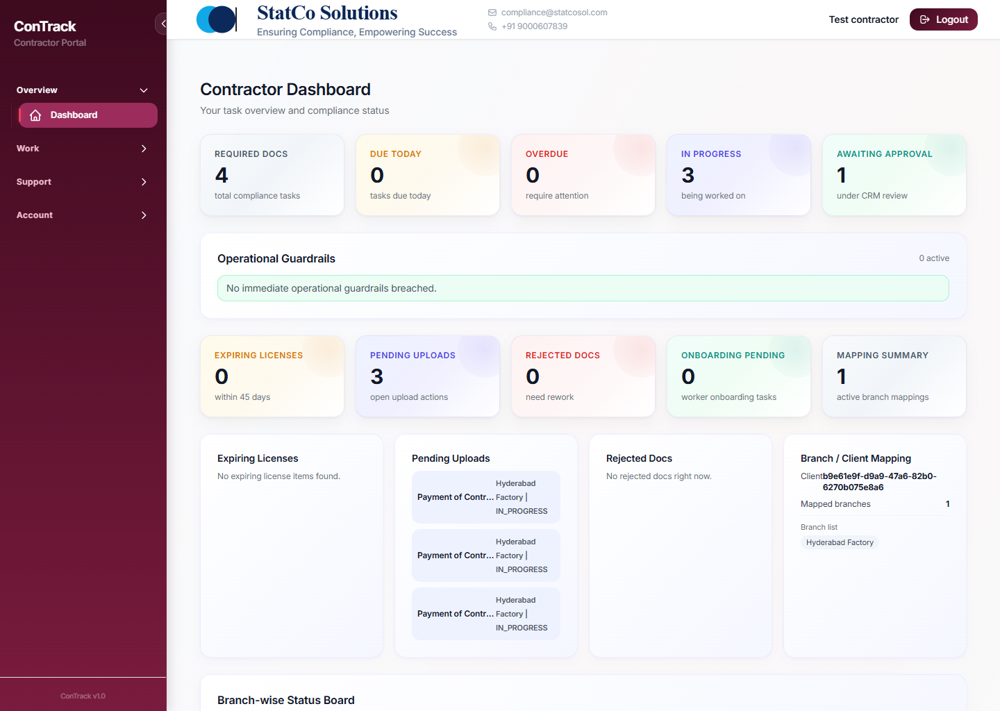

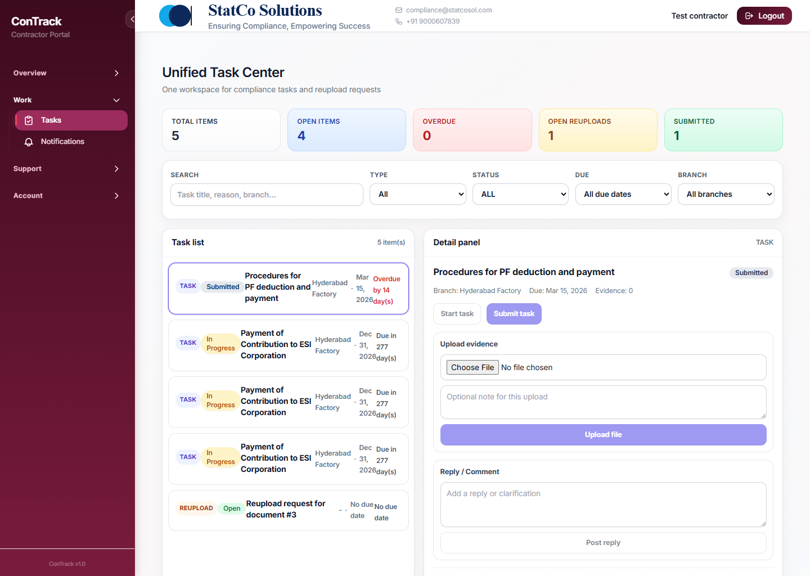

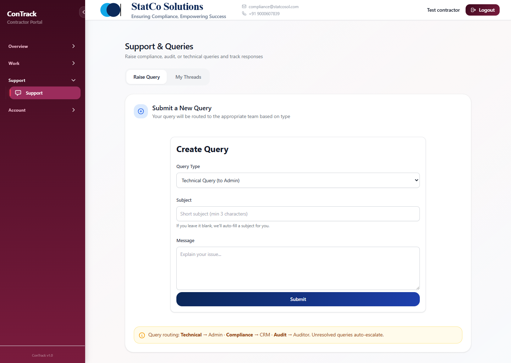

## 12. Payroll Training Flow

**Training objective:** teach the Payroll user how to enter client-scoped workspaces, process runs, manage statutory outputs, and publish payroll results.

### 12.1 Daily Payroll Review Flow

1. Log in and open the dashboard.
2. Review Assigned Clients, Total Employees, Active Runs, Pending Runs, PF Pending, ESI Pending, and Registers.
3. Review recent payroll runs from the dashboard.
4. Identify the client and period that require action today.

### 12.2 Client Workspace Entry Flow

1. Open **Clients**.
2. Select an assigned client from the list.
3. Enter the client workspace.
4. Explain the client context strip and that all payroll actions are client-specific after this point.
5. Review the workspace navigation: Employees, Payroll Runs, PF/ESI, Registers, Full and Final, Queries, Setup, Rule Sets, and Structures.

### 12.3 Monthly Payroll Run Flow

1. Open **Payroll Runs** inside the client workspace.
2. Filter by month and year.
3. Open the active run.
4. Follow the process sequence: Input Freeze, Attendance Import, Arrears, Preview, Approval.
5. Review validation exceptions and correct issues before submission.
6. Process the run.
7. Submit the run for approval.
8. After approval, publish the run so employee outputs become available.

### 12.4 Reports and Registers Flow

1. Open **Reports** from the global payroll menu.
2. Select client, year, month, and financial year.
3. Download Bank Statement, Muster Roll, Cost Analysis, or Form 16/TDS Summary as needed.
4. Open **Registers** in the client workspace when register outputs are required.

### 12.5 Payroll Exception and Query Flow

1. Open **PF / ESI Compliance** for statutory gaps or remittance readiness.
2. Open **Queries** for client-side payroll questions.
3. Respond with clarification or supporting output where required.
4. Use **Full & Final** for exit settlement processing when needed.

### 12.6 Payroll Handoff

1. Published payroll outputs feed employee payslips and downstream compliance records.
2. Payroll registers are reviewed by Client, CCO, or CEO where applicable.
3. PF/ESI issues may also feed the PF Team helpdesk flow.

Reference screenshots:

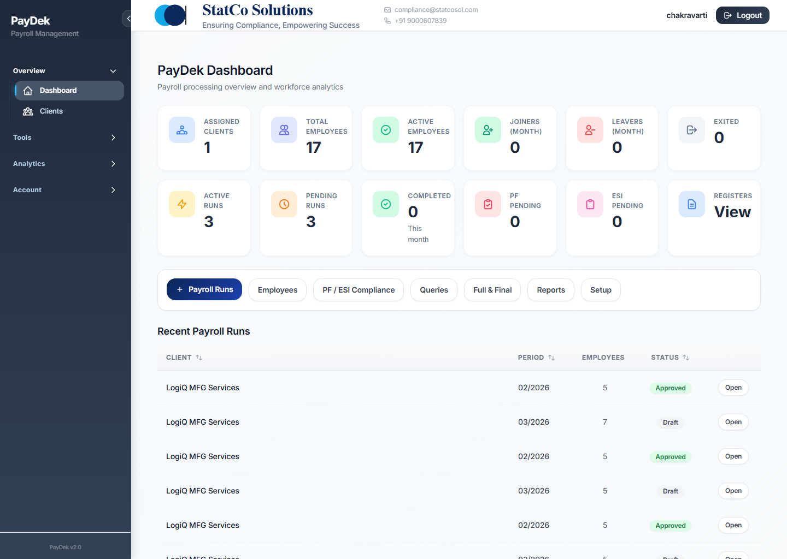

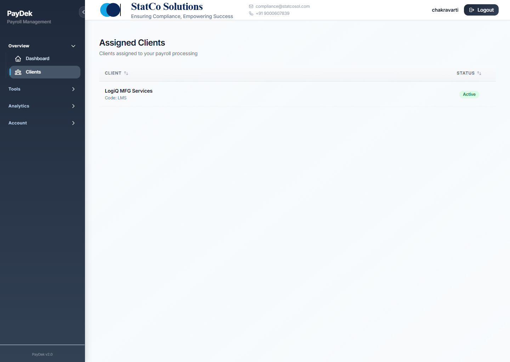

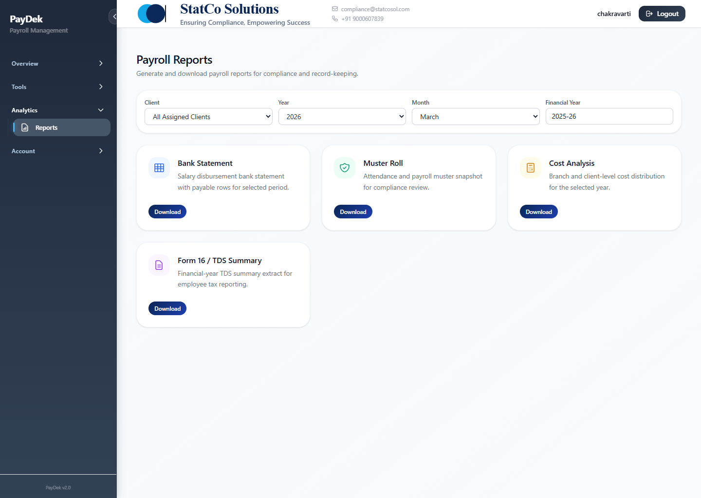

## 13. PF Team Training Flow

**Training objective:** teach PF Team users how to triage, work, and close employee or payroll-related PF and ESI tickets.

### 13.1 Daily Queue Review Flow

1. Log in and open the dashboard.
2. Review Total Tickets, Open, In Progress, and SLA Breached.
3. Review category-wise and client-wise ticket distribution.
4. Identify urgent, high-priority, or SLA-breached tickets first.

### 13.2 Ticket Processing Flow

1. Open **Tickets**.
2. Filter by client, status, category, or priority.
3. Open the selected ticket.
4. Review employee details, issue description, and ticket history.
5. Update the ticket with progress, clarification, or resolution.
6. Move the status forward until the issue is resolved.
7. Close the ticket when the issue is complete.

### 13.3 PF Team Handoff

1. If a ticket depends on Payroll, coordinate with Payroll.
2. If the ticket depends on employee action or missing information, request the details and keep the ticket tracked.
3. If the issue is resolved, closure is visible to the originator.

Reference screenshots:

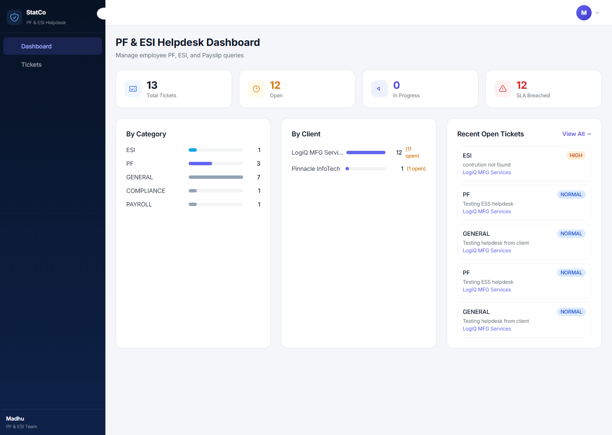

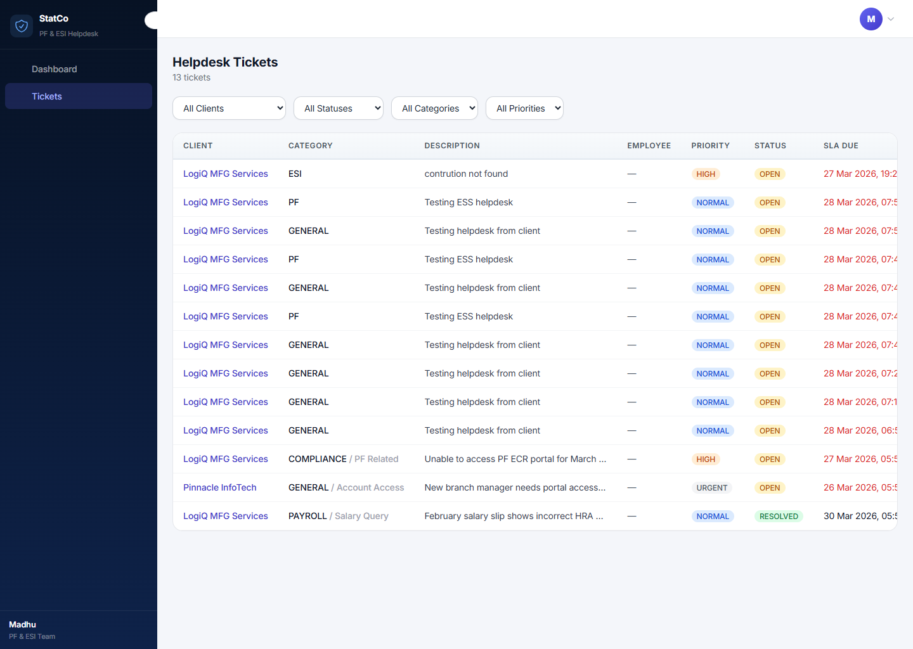

## 14. ESS Training Flow

**Training objective:** teach employees to use self-service features for payslips, documents, leave, profile, and helpdesk.

### 14.1 ESS Login and Start Flow

1. Open the ESS login page.
2. Enter company code, employee email, and password.
3. Click **Sign In**.
4. Confirm the employee lands on the dashboard.
5. Explain the menu and quick actions.

### 14.2 Daily Employee Self-Service Flow

1. Review Latest Payslip, PF/UAN, ESI/IP, and Leave Balance from the dashboard.
2. Review recent activity.
3. Use quick actions when the employee wants immediate access to payslip, leave, nomination, or profile.

### 14.3 Payslip and Document Flow

1. Open **Payslips**.
2. Filter by year and month if required.
3. Download the required payslip PDF.
4. Open **Documents**.
5. Use category, year, status, sort, or search filters.
6. Preview or download required documents.

### 14.4 Employee Action Flow

1. Open **My Profile** to review personal and employment details.
2. Open **My PF** and **My ESI** to review scheme details.
3. Open **Nominations** to add or update nominee records.
4. Open **Leave** to apply for leave and track its approval status.
5. Open **Attendance** to review attendance records.

### 14.5 ESS Helpdesk Flow

1. Open **Helpdesk**.
2. Raise a PF, ESI, payslip, or related support issue when required.
3. Track the ticket or thread until a response is received.

### 14.6 ESS Handoff

1. Payroll-generated outputs appear in ESS after payroll publishing.
2. Helpdesk issues may route to PF Team, Payroll, or HR support depending on the issue type.

Reference screenshots:

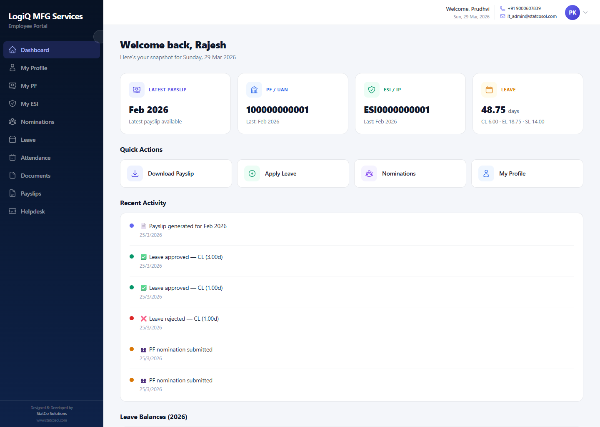

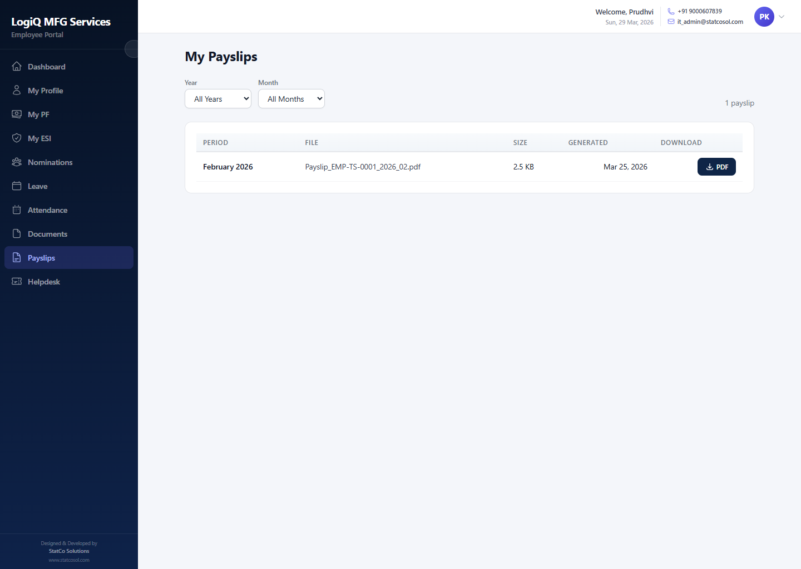

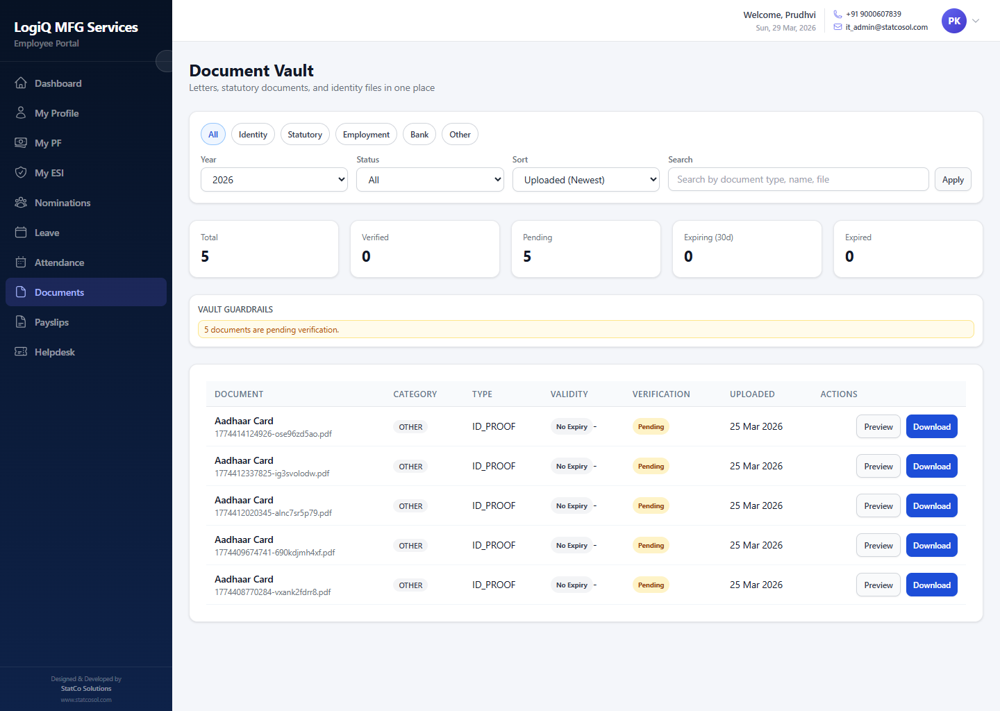

## 15. Cross-Module Complete Process Flows

Use these sections for role-based handoff training.

### 15.1 New Client Setup to Operations

1. Admin creates the client and master user.
2. Admin creates branches and user accounts.
3. Admin assigns CRM, Auditor, and Payroll owners.
4. Client and Branch teams start maintaining branch and employee data.
5. CRM begins compliance supervision for the new client.

### 15.2 Branch Upload to CRM Review

1. Branch uploads monthly or periodic compliance evidence.
2. CRM reviews the uploaded evidence.
3. CRM approves valid evidence or returns it for reupload.
4. Branch corrects the evidence and resubmits.
5. Approved items continue toward closure and reporting.

### 15.3 Contractor Task to Approval

1. CRM creates or routes a contractor task.
2. Contractor starts the task and uploads evidence.
3. Contractor submits the task.
4. Reviewer approves the work or rejects it for correction.
5. Rejected tasks return to the Contractor for reupload and resubmission.

### 15.4 Audit End-to-End Flow

1. CRM creates the audit and assigns an Auditor.
2. Auditor executes fieldwork in the workspace.
3. Auditor raises observations and requests reuploads where needed.
4. Auditor completes the report builder.
5. Completed audit outputs are reviewed by CRM, CCO, and CEO as needed.

### 15.5 Payroll to ESS Flow

1. Payroll enters the client workspace and processes the payroll run.
2. Payroll submits and gets the run approved.
3. Payroll publishes the run.
4. Payslips and payroll outputs become available in ESS.
5. Employees download payslips and raise support tickets if needed.

### 15.6 Escalation Chain Flow

1. A branch, compliance item, or task becomes overdue.
2. CRM works the item first.
3. If the issue remains unresolved, CCO reviews and intervenes.
4. If the issue is severe, business critical, or repeatedly unresolved, CEO reviews it.
5. Resolution flows back to the operating team for closure.
