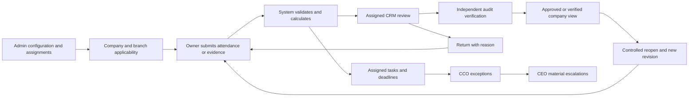

# StatComPy project research and modernization

Research date: 12 September 2026. Local baseline: `12396a4d`, including the contractor payroll review corrections. Current work: `codex/project-modernization-20260912`.

## Assessment

StatComPy already has a broad operational platform, rather than a missing set of portals. The main architectural gap is consistency: separate task, compliance, approval, attendance and document models sometimes interpret the same user's authority or reporting period differently. The first modernization priority is therefore reliable shared rules and traceable evidence, followed by richer automation.

This research inventories the complete backend declaration tree and frontend route files, reviews the central identity/deployment architecture and traces selected high-risk workflows. It does **not** certify every endpoint, statutory calculation, production dataset, mobile device or role journey. The accompanying source map distinguishes declaration coverage from runtime verification.

## Current structure

| Layer | Source evidence | Responsibility / implication |
| --- | --- | --- |
| Web portals | `frontend/src/app`, route inventory | Angular application with role-based routes, shared services/components and portal dashboards. A hidden menu is not an authorization boundary. |
| API | `backend/src/app.module.ts` | NestJS modular application. Global throttling, JWT, roles, scope and service-entitlement guards precede domain services. Record ownership still needs validation inside resource operations. |
| Database | AppModule TypeORM configuration; entity inventory | PostgreSQL, with explicit SQL migrations and production synchronization disabled. SQL uses PostgreSQL arrays, casts, locking and JSON features; treating it as MySQL-compatible would be incorrect. |
| Evidence | files, compliance-documents, branch-compliance, monthly-documents, safety-documents | Several document families with distinct review lifecycles. A common evidence reference/version contract is needed before consolidating their completion figures. |
| Attendance | attendance, biometric, mobile-attendance, facedesk; `mobile/README.md` | Multiple collection paths plus native Android kiosk/offline operation and ESS WebView. These need one approved input version when consumed by payroll. |
| Face processing | `face-svc/README.md`, Python app/tests | Separate internal inference service. Model availability, enrollment consistency and offline recovery are distinct from browser/API correctness. |
| Delivery and recovery | `.github/workflows/ci.yml`, deploy-azure, backup and restore workflows | CI includes PostgreSQL metadata checks, tests and module wiring. Azure container deployment and backup/restore workflows exist. Their presence does not prove a recent successful restore or production rollout. |
| AI | `backend/src/ai`, LegitX assistant | Existing provider adapter, configuration, cost tracking and domain features. Compliance explanations are grounded in scoped tasks, with a rules fallback. No new provider or autonomous business action is introduced here. |

The source inventory contains 241 controller declarations. The module checker reports 238 unique registered controller **names** because three names are reused in the separate `branch-compliance` and `compliance-documents` domains. Their route prefixes differ. This discrepancy is a counting limitation, not evidence of three missing routes. The checker found no orphan services/controllers or missing feature modules.

## Roles and authority

Portal names and stored role codes must remain separate concepts. In particular, LegitX is generally `CLIENT` with a master user type; BranchDesk can be `CLIENT` with `userType=BRANCH` or `BRANCH_DESK`. PayDek is a portal/alias around payroll access. Other legacy branch labels appear in endpoint decorators and need controlled normalization, not silent privilege equivalence.

| User / portal | Intended scope and responsibility | Important boundary |
| --- | --- | --- |
| Admin | Platform setup, users, configuration and controlled recovery | Administrative capability must not silently stand in for independent approval or verification. |
| CEO | Company-wide management visibility and exceptional decisions | Routine work should remain with its assigned owner; executive visibility is not routine payroll processing. |
| CCO | Operational oversight of clients managed through its CRMs | Generic access service still treats CCO as global in some domains. The new operational helper explicitly applies managed-client scope to the changed workflows. Other call sites remain review candidates. |
| CRM | Currently assigned companies; execution, coordination and review | Omitting a company filter must still restrict the query to assigned companies. |
| AuditXpert / AUDITOR | Assigned companies/branches; independent evidence verification | Review assignment and independence must be checked against the source record; verifier must not rewrite payroll calculations. |
| LegitX / CLIENT master | Own company and its establishments | Consolidation must reconcile to underlying evidence and approved payroll versions. |
| BranchDesk | All assigned branches in own company | Empty assignment means no branch records. Branch authority must not reverse company approval. |
| ConTrack / CONTRACTOR | Own contractor identity, deployment and company | Tenant scope alone is insufficient: worker, attendance, document and payroll records need contractor ownership checks. |
| PayDek / PAYROLL | Current payroll client assignments | No global administrator fallback. Legacy payroll tasks are restricted by both company and PAYROLL module. |
| ESS / EMPLOYEE | Own employee records | Company membership is not permission to read other employees. |
| PF_TEAM / Helpdesk | Assigned statutory service cases | Employee identity, case participants, attachments and escalation scope must be consistent. |
| ACCOUNTS / SALES | Commercial records and assigned business responsibilities | Operational approval does not imply invoice/payment authority; commercial and compliance state should remain separate. |
| Device identities | Provisioned device/client/branch and supported operations | Device credentials must not inherit human administrative roles. |

## Workflow model

This is the target shared pattern, not a claim that every existing module already implements it. Source records retain their own domain states. Task status is a projection for work management and must not itself prove that payroll was approved, statutory evidence was verified or a payment was made.

Contractor payroll already has the local draft → submit → CRM approve → independent auditor verify/lock workflow, immutable revisions and controlled reopening. The prior implementation report contains its tested behavior and remaining report-pack requirements. Ordinary payroll currently has a separate processor/CCO approval model; changing it to the blueprint's CRM/client confirmation model requires an explicit transition and data migration design.

## Changes implemented in this modernization pass

| Finding | Implemented change | Verification |
| --- | --- | --- |
| Unfiltered CRM/auditor task lists could lack a company restriction; payroll was treated as global | Task queries now use current operational company scope, including an empty array that returns no rows. Unknown roles and missing identities fail closed. | Role matrix and actual PostgreSQL query tests |
| CCO operational scope differed between endpoints | Shared OperationalScopeService derives managed CRM companies and validates explicit company/branch requests and resource updates. | CCO scope unit regression; existing CCO ownership implementation retained |
| Branch operational pages could select the first branch or widen empty assignments | SLA, escalations, task queues and risk heatmaps preserve all assignments; empty sets remain restrictive. | Multi-branch and empty-scope regressions |
| Risk trend requests by branch ID lacked consistent scope validation | Validate branch access before loading trends; validate calendar inputs; global manual snapshot is now Admin/CEO only. | Controller and SQL predicate regressions |
| SLA/escalation changes could accept arbitrary status and insufficient resource authorization | Validate record scope and permitted status values; serialize edits using PostgreSQL row locks. Deadline/owner edits require operations-manager authority. | Real database unauthorized updates, invalid states/dates and concurrent patches |
| SLA reopen retained closure metadata; overdue filter relied on stored status | Clear closedAt on reopen; calculate overdue from calendar due date; query derived overdue states correctly. | Actual entity/database regression |
| Tasks due today appeared overdue; cancelled tasks inflated overdue totals; dueSoon was absent | Use Indian calendar dates, exclude terminal tasks and return the frontend's dueSoon field. | Date-boundary, cancelled/closed and summary tests |
| AI adapter failure could discard the factual compliance plan | Retain the rules plan on adapter rejection; use the Indian reporting month at timezone boundaries. | Provider rejection and month-boundary tests |
| Architecture documentation had stale scope/runtime assumptions | Added reproducible AST source map, role/workflow assessment and prioritized acceptance backlog. | Inventory generation and module checker |

Legacy ADMIN-assigned oversight tasks remain readable by CCO only within managed companies. PAYROLL can read its own role plus legacy ADMIN-assigned tasks only in its assigned companies and the PAYROLL module. No legacy tasks are rewritten and no new authority to mutate their source records is granted.

## Advanced roadmap and completion gates

| Priority | Area | Concrete next increment and acceptance gate |
| --- | --- | --- |
| 1 | Shared authorization | Migrate remaining CCO/global, record-ID and export paths to explicit domain policies. Add HTTP role × company × branch × ownership tests; reassignment must immediately remove old access. |
| 1 | Approval evidence | Append actor, authority, reason, old/new state and source revision to every approval/reopen event. An editable task status must not close a source approval. SLA/escalation edit history is not added by this pass. |
| 1 | SLA ownership | Validate assignee eligibility against the task's company/branch and assignment lifecycle. This pass restricts who may edit ownership, but does not implement a full assignee eligibility policy. |
| 1 | Reporting reconciliation | Reconcile dashboard, work queue, exports and month-close counts on one scope/period fixture, including multiple branches and runs. Keep the recently corrected audit period and payroll-run selection regressions. |
| 2 | Canonical attendance | Store an approved attendance version and source provenance consumed by payroll. Late punches, leave corrections and transfers must invalidate or reopen dependent results through an explicit workflow. |
| 2 | ConTrack / PayDek | Complete component/work-order rates, effective-period splits, authorized adjustments, exception ownership and the final wage/muster/payslip/bank/statutory working pack. Each output must identify its approved payroll revision. |
| 2 | Audit and monthly close | Link findings to evidence versions and verified payment/remittance records. Test returned/reuploaded/reviewed/verified states and prevent closure with unresolved mandatory findings. |
| 2 | Applicability and registrations | Effective-dated establishment/law/headcount rules with source references, reassessment tasks and expiry schedules; test state transitions and exceptions against configured rules. |
| 2 | Work queue and notifications | Adopt a canonical task-reference contract, explicit owner reassignment, deduplicated event delivery and paginated lists/SQL aggregate summaries. Current compatibility list endpoints remain unpaginated; removing silent 200-row truncation improves completeness but needs scale testing. |
| 2 | Risk | Replace the current duplicated expired-registration weighting with separately evidenced dimensions and displayed contributing facts. Validate calibration and historical snapshot semantics before using scores for material decisions. |
| 2 | ESS / Helpdesk | Exercise own-record isolation, sensitive-profile change approval, case participant scope, attachment access and SLA escalation end to end. |
| 2 | Billing / Sales | Link approved service/work-order facts to invoices and payment aging, retaining separate commercial authority and audit history. |
| 3 | Explainable AI | Expand the existing scoped explanation pattern only after source reconciliation. Evaluate unsupported claims, prompt injection, cross-company leakage, empty data and provider outages. Show cited record links, authority, period and coverage; do not permit AI to approve, pay, file or lock records. |
| 3 | Mobile / face service | Device-level tests for reconnect, retry deduplication, model changes and enrollment recovery. No device or inference runtime behavior was changed or certified here. |
| 3 | BlockIT | Define evidence hash/version verification and signed bundles first. No existing upload should be advertised as blockchain verified without a working verification mechanism. |
| 3 | Operations | Repeat restore and release exercises, measure query latency and job duplication, and add per-domain availability signals. Local tests are not a production restore/deployment result. |

## Research principles and evidence

The authorization design follows deny-by-default and validation on every request, including object access, from the [OWASP Authorization Cheat Sheet](https://cheatsheetseries.owasp.org/cheatsheets/Authorization_Cheat_Sheet.html). Consistent tenant context and isolation are supported by the [OWASP Multi-Tenant Security Cheat Sheet](https://cheatsheetseries.owasp.org/cheatsheets/Multi_Tenant_Security_Cheat_Sheet.html). Server-side workflow enforcement is supported by the [OWASP REST Security Cheat Sheet](https://cheatsheetseries.owasp.org/cheatsheets/REST_Security_Cheat_Sheet.html). These are engineering references, not proof that this project meets every recommendation.

Source evidence: [source map](SOURCE_MAP.md), [machine-readable inventory](source-inventory.json), [contractor blueprint implementation and backlog](../../reviews/2026-09-12/blueprint/REPORT.md). The inventory can be regenerated with `node backend/scripts/research-project.cjs` from the repository root. It does not read runtime secrets.

## Validation and release status

Final executed results are recorded below. All changes remain local. No production data, provider configuration, published branch or deployed application was modified in this pass. The latest prior payroll corrections and these modernization changes still require an authorized publication before release.

- Final source inventory: **951 backend source files, 184 test files, 63 modules, 241 controller declarations, 1,475 HTTP handlers, 229 entity classes, 363 frontend route declarations and 39 scheduled methods**.
- Full backend suite: **1,136 passed**, one environment-dependent test skipped. After the final payroll query correction, the complete affected set passed: **45 tests across seven suites**, including the added parameter-binding regression.
- Backend and frontend production builds passed. Frontend reports existing Sass deprecation warnings; no frontend source was changed in this pass.
- Affected lint and whitespace checks passed. Module wiring: **255 registered providers**, 238 unique controller names, no orphan services/controllers or missing feature modules.
- Disposable PostgreSQL regression passed using tables created from the actual TypeORM entity columns. It exercises company and multi/empty-branch filters, unauthorized updates, invalid states/dates, close/reopen, concurrent patches, task calendar semantics and legacy CCO/payroll queue compatibility. It isolates domain tables rather than recreating the full production database and foreign-key graph.
- AI tests verify rules fallback, source scope failure, malformed output, fixed application-owned routes and reporting-month boundaries. No live AI-provider call was used as a release test.
- Reproducible database check: build the backend, start the documented disposable local PostgreSQL test instance and run `node backend/scripts/validate-operational-scope.cjs`. The script creates and removes its own uniquely named schema; it does not read production connection settings.
- No new database migration is required for this modernization commit. The inherited contractor payroll authority change still requires its separately registered migration when released.
